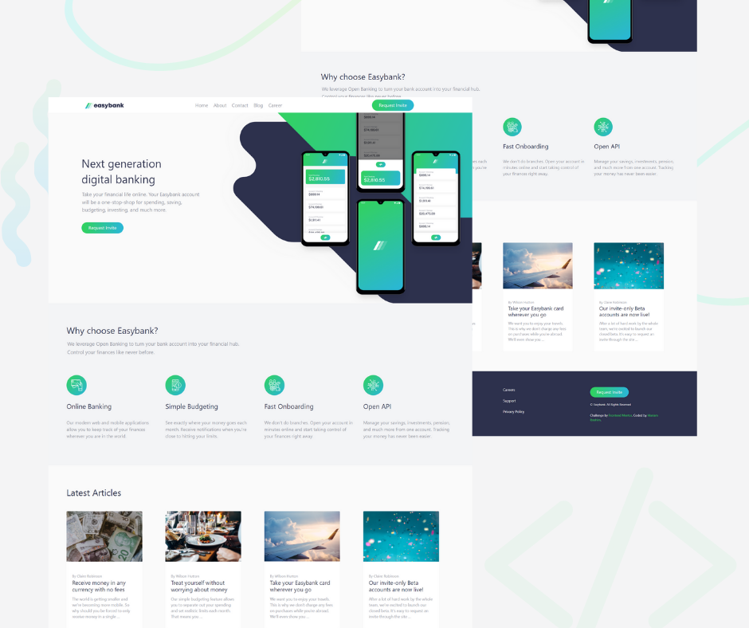

# Frontend Mentor - Easybank landing page solution

This is a solution to the [Easybank landing page challenge on Frontend Mentor](https://www.frontendmentor.io/challenges/easybank-landing-page-WaUhkoDN). 

## Table of contents

- [Overview](#overview)
  - [The challenge](#the-challenge)
  - [Screenshot](#screenshot)
  - [Links](#links)
- [My process](#my-process)
  - [Built with](#built-with)
  - [Useful resources](#useful-resources)
- [Author](#author)

## Overview

### The challenge

Users should be able to:

- View the optimal layout for the site depending on their device's screen size
- See hover states for all interactive elements on the page

### Screenshot

### Links

- Live Site URL: [Add live site URL here](https://mariam11ibrahim.github.io/easyBank-LandingPage/)

## My process

### Built with

- Semantic HTML5 markup
- SCSS  
- BootStrap4
- [FontAwesome](https://fontawesome.com/)
- Mobile-first workflow
- JavaScript
- TypeScript
- [Angular](https://angular.io/) - JS Framework

### Useful resources

- [Sass documentation](https://sass-lang.com/documentation) 
- [Bootsrtap4 documentaion - w3school ](https://www.w3schools.com/bootstrap4/default.asp) 

## Author
- Linked in - [Mariam Ibrahim ](https://www.linkedin.com/in/mariam11ibrahim/)

